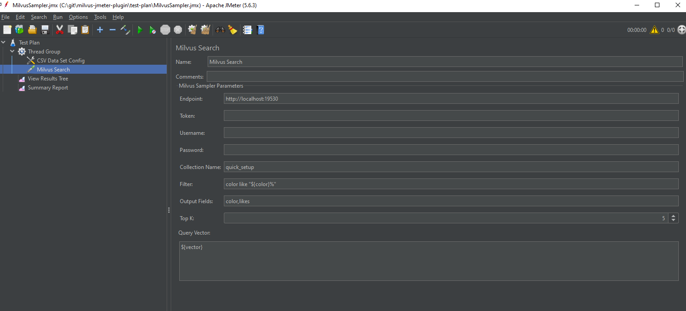

# Milvus JMeter Plugin

This project is a JMeter plugin for testing and interacting with the [Milvus](https://milvus.io/) vector database. It allows users to perform search operations on Milvus collections directly from JMeter.

## Features

- **Milvus Search**: Perform search operations on Milvus collections.
- **Configurable Parameters**: Easily set up endpoint, authentication, collection details, and query parameters.

## Getting Started

### Prerequisites

- **Apache JMeter 5.6.3**: Ensure you have JMeter installed.
- **Milvus**: A running instance of Milvus to connect to.

### Installation

1. **Download the plugin**:
   
   Go to the [GitHub Releases page](https://github.com/topikachu/milvus-jmeter-plugin/releases) and download the latest `milvus-jmeter-plugin-x.y.z-all.zip` file.

2. **Extract the files**:
   
   The zip file contains a `lib/ext` folder structure. Extract the contents directly into your JMeter's root directory. This will automatically place the files in the correct `lib/ext` subdirectory.

   For example, if your JMeter is installed in `/path/to/jmeter`, you can use:

   ```bash
   unzip milvus-jmeter-plugin-x.y.z-all.zip -d /path/to/jmeter/
   ```
   This command will maintain the internal folder structure and place the files correctly.
3. **Verify the installation**:
Check that the plugin files are now present in your JMeter's lib/ext directory.
4. **Restart JMeter**:
If JMeter was already running, restart it to load the new plugin.
## Usage

1. **Open JMeter** and create a new Test Plan or open an existing one.

2. **Add a Milvus Search sampler**:
   - Right-click on your Test Plan or Thread Group
   - Select "Add" > "Sampler" > "Milvus Search"

3. **Configure the Milvus Search sampler**:

   

   - **Endpoint**: Set the Milvus server endpoint (e.g., `http://localhost:19530`).
   - **Token** *(Optional)*: Provide a token if authentication is required.
   - **Username/Password** *(Optional)*: Provide credentials if needed.
   - **Collection Name**: Specify the collection to search (e.g., `quick_setup`).
   - **Filter**: Define any filters for the search (e.g., `color like "red%"`)
   - **Top K**: Set the number of top results to return (e.g., `5`)
   - **Output Fields**: List the fields to retrieve (e.g., `color,likes`)
   - **Query Vector**: Provide the query vector as a comma-separated list of values (e.g., `0.3580376395471989,-0.6023495712049978,0.18414012509913835,-0.26286205330961354,0.9029438446296592`)

   Note: You can use JMeter variables (e.g., `${variable_name}`) for dynamic values in your test plan.

4. **Run the test plan** to execute the search operation.

Note: An example test plan named [MilvusSampler.jmx](test-plan/MilvusSampler.jmx) is provided in the plugin package. You can use this as a reference to understand how to set up and configure the Milvus Search sampler in your own test plans.

## Results

- **View Results Tree**: Inspect the response from Milvus.
- **Summary Report**: Analyze the performance metrics of the search operation.

## Contributing

Contributions are welcome! Please fork the repository and submit a pull request for any improvements or bug fixes.

## License

This project is licensed under the MIT License. See the [LICENSE](LICENSE) file for details.

## Contact

For questions or support, please contact [topikachu@163.com](mailto:topikachu@163.com).

---

*Feel free to customize this README with your specific repository URL, contact information, and any additional instructions or features.*